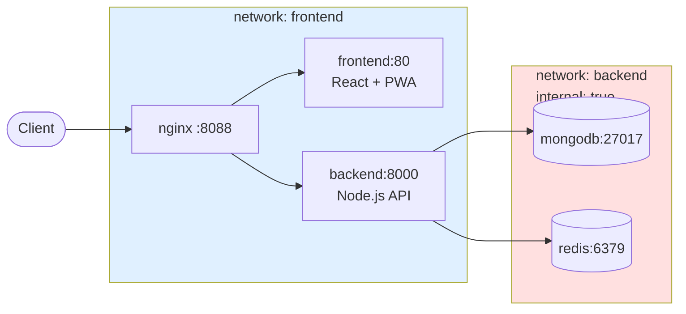

<!-- Context: stacks/fullstack-containerized | Priority: high | Version: 1.0 | Updated: 2026-05-07 -->

# Fullstack Containerized Blueprint

**Purpose**: Reference architecture for fullstack web apps with nginx reverse proxy, Node.js API, React PWA, MongoDB, and Redis — fully isolated via Docker networks.

**When to use**: Medium-to-large apps needing service isolation, horizontal scaling readiness, offline-first frontend, and production-grade observability.

---

## Architecture



**Key decisions:**

- **nginx** = único entry point público (TLS, rate limit, headers de segurança centralizados)
- **frontend + backend** compartilham rede pública (nginx pode proxy para ambos)
- **backend** acessa mongo/redis por rede interna (`internal: true`) — DBs **nunca** expõem portas externamente
- Todas as portas internas usam `expose` (não `ports:`) — apenas o nginx expõe ao host

---

## Service Responsibilities

| Service | Image | Purpose | Expose |
|---------|-------|---------|--------|
| nginx | `nginx:alpine` | Reverse proxy, TLS termination, static assets cache, rate-limit | `ports: "8088:80"` |
| frontend | built locally | Serve SPA/PWA assets (production: nginx dentro do container) | `expose: "80"` |
| backend | built locally | Express API, business logic, auth | `expose: "8000"` |
| mongodb | `mongo:7.0` | Primary database | `expose: "27017"` |
| redis | `redis:7.2-alpine` | Cache, sessions, pub/sub | `expose: "6379"` |

---

## Environment Variables Strategy

**Rule**: Vite variables são **build-time**, não runtime.

```yaml
# docker-compose.yml — NÃO coloque VITE_* aqui!
frontend:
  image: myapp/frontend:${FRONTEND_VERSION:-1.0.0}
  # VITE_API_URL must be --build-arg at build time
```

```bash
# Build com variáveis embutidas
docker build \
  --build-arg VITE_API_URL=https://api.myapp.com \
  --target production \
  -t myapp/frontend:1.0.0 \
  -f frontend/Dockerfile .
```

**Backend**: runtime env vars normais (`MONGODB_URI`, `JWT_SECRET`, etc).

---

## Healthchecks — Mandatory

Todos os serviços **precisam** healthcheck. `depends_on` usa `condition: service_healthy`:

```yaml
nginx:
  healthcheck:
    test: ["CMD", "nginx", "-t"]
    interval: 30s
    timeout: 3s
    retries: 3
    start_period: 5s

backend:
  healthcheck:
    test: ["CMD", "wget", "--spider", "http://localhost:8000/health"]
    interval: 30s
    timeout: 3s
    retries: 3
    start_period: 15s

mongodb:
  healthcheck:
    test: echo 'db.runCommand("ping").ok' | mongosh localhost:27017/test --quiet
    interval: 10s
    start_period: 20s

redis:
  healthcheck:
    test: ["CMD", "redis-cli", "ping"]
    interval: 10s
```

**Sem healthcheck → sem `depends_on condition`** — ordem de startup vira caótica.

---

## Log Rotation — Mandatory

Todos os serviços:

```yaml
logging:
  driver: "json-file"
  options:
    max-size: "10m"
    max-file: "3"
```

Impede disk-full em produção.

---

## Compose Override Pattern (NOT .yml.bak)

**Estrutura recomendada:**

```
docker-compose.yml              # Base — production-ready
docker-compose.override.yml     # Dev — hot reload, volume mounts (auto-loaded)
docker-compose.prod.yml         # Explicit prod overrides (CI/CD)
```

**Start dev**: `docker compose up` (carrega base + override)
**Start prod**: `docker compose -f docker-compose.yml -f docker-compose.prod.yml up`

Nunca: `.yml.bak` no repo. Use git para versioning.

---

## Shared Constants (cross-stack)

Pasta `shared/` na raiz com constantes reutilizadas entre backend e frontend:

```
shared/
├── package.json               # "name": "@myapp/shared"
└── constants/
    └── asset-types.js         # export const ASSET_TYPES = { ... }
```

**No Dockerfile** (ambos back e front):

```dockerfile
COPY shared/ /shared/          # Self-contained, no volume mounts
```

**Não use symlinks absolutos** (`shared -> /home/user/...`) — quebra em CI. Use:

- Vite alias: `resolve.alias: { '@shared': path.resolve('./shared') }`
- npm workspaces no package.json raiz

---

## Secrets Management

**Dev**: `.env` (gitignored) + `.env.example` versionado

**Prod**: Docker secrets ou HashiCorp Vault — nunca `.env` em servidor prod.

```yaml
# docker-compose.prod.yml
backend:
  secrets:
    - jwt_secret
    - google_client_secret

secrets:
  jwt_secret:
    external: true
```

---

## Networks — Isolation Mandatory

```yaml
networks:
  frontend:
    driver: bridge
    name: myapp_frontend         # Named network
  backend:
    driver: bridge
    name: myapp_backend
    internal: true               # ⚠️ CRITICAL: no external access
```

**Regra**: backend network **sempre** `internal: true`. DBs e cache nunca devem ser acessíveis externamente.

---

## Related Context

- `standards/dockerfile-patterns.md` — multi-stage, non-root, dumb-init
- `stacks/nodejs-domain-structure.md` — backend modular pattern
- `stacks/react-domain-structure.md` — frontend PWA pattern
- `standards/security.md` — nginx hardening checklist
